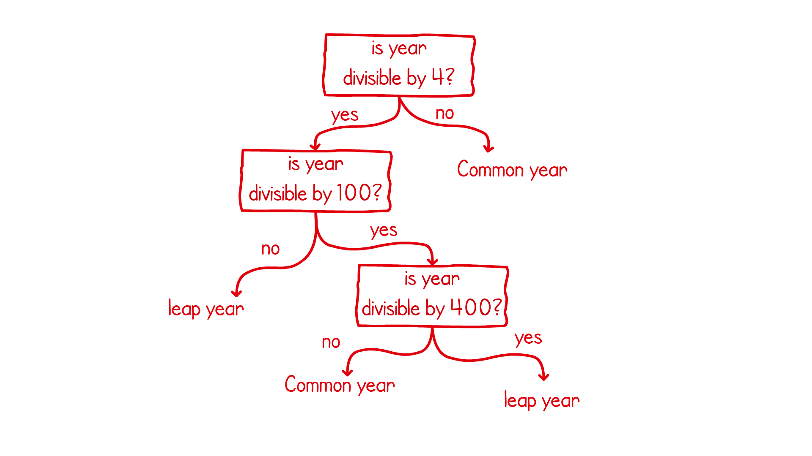

#Java Fundamentals Practical Exercise

Intro Intro Intro

## Steps for installation

1. Download the latest java SDK
2. Clone this repository
3. 

## How to use this project

This is how to use this project, bla bla bla

## About the Creator
James Cutajar is a software developer with an interest in scalable, high-performance computing and 
distributed algorithms. He has worked in the technology field for over 15 years in various industries. 
He is also an author of various video courses on Scala and a book on data structures and algorithms in Java.
Throughout his career, he has been an instructor, open source contributor, blogger, and a tech evangelist. 
When he is not writing software, he is riding his motorbike, surfing, scuba diving or flying light aircraft. 
He was born in Malta, lived in London for almost a decade and is now working in Portugal.
Visit the author's blog at www.cutajarjames.com

## Exercises

### Lesson 1 - SayHello

Fill the empty main method with a program that asks for the user's name 
and replies with a greeting saying. For example "Hello James". The program
also needs to output the length in character of the user's name.

* Class name: `com.packt.jamescutajar.lesson1.SayHello`
* Method name: `public static void main(String[] args)`
* Test name: `com.packt.jamescutajar.lesson1.SayHelloTest`

***Example:***
```
Please enter your name:
James
Hello James
Your name is 5 characters long
```

#### Extra Task
In addition to the above, the main method can also be enhanced to output
today's date to the user in the format shown in the example below.

***Example:***
```
Please enter your name:
James
Hello James, Today is Wed 8th September 2019 
Your name is 5 characters long
```

### Lesson 2 - FindShapeArea

In this exercise we want to write different methods to find the area of 3 different 
shapes; A square, a circle and a right angle triangle.

In the provided class you should find 3 different methods, one for each shape. 
Each of these methods needs to compute the area of the shape based on the 
provided method input.

* Class name: `com.packt.jamescutajar.lesson2.FindShapeArea`
* Method names:
```
public int squareArea(int side)
public double circleArea(int radius)
public double rightAngleTriangleArea
```
* Test name: `com.packt.jamescutajar.lesson2.FindShapeArea`

***Examples:***
```
squareArea(3) returns 9
circleArea(5) returns 78.5398
rightAngleTriangleArea(5, 3) returns 7.5
```

#### Extra Task
Add extra methods to the class to find the perimeters of the
same shapes (circle, square, and right angle triangle)

***Examples:***
```
squarePerimeter(5) returns 20
circleCircumference(4) returns 25.1327
rightAngleTrianglePerimeter(5, 3) returns 13.8309
```

### Lesson 3a - LeapYearCheck
Leap years are years in which February is longer by a day. In this lesson
we want to write a simple algorithm that can tell us if a year is a leap 
year or not. The following is a flow chart showing how we can determine 
if a year is a common or a leap year. Implement this logic in a java method
return true if the year is a leap one.



* Class name: `com.packt.jamescutajar.lesson3.LeapYearCheck`
* Method name:`public boolean isLeapYear(int year)`
* Test name: `com.packt.jamescutajar.lesson3.LeapYearCheckTest`

***Examples:***
```
isLeapYear(1995) returns false //1995 is not a leap year
isLeapYear(2004) returns true  //2004 is a leap year
```

### Lesson 3b - TernaryConversion
We are used to a decimal number representation system. A decimal system is 
one where we have symbols from 0 to 9. There are many
other representation systems. In an octal representation we have 8 symbols,
0 to 7. In a hexadecimal we have 16 and in binary we only have two (0 and 1).
The ternary number representation contains the symbols of 0, 1, and 2.
In this task you need to write a conversion from decimal to ternary.

The conversion algorithm works by dividing the decimal input by 3 a number
of times until the result is 0. At every division the reminder is used to 
build the string result. The following is a run through the algorithm for a 
conversion to ternary for the decimal number:

```
Decimal input = 178
178 division by 3 = 59 remainder 1
59  division by 3 = 19 remainder 2
19  division by 3 = 6  remainder 1
6   division by 3 = 2  remainder 0
2   division by 3 = 0  remainder 2
Ternary output = 20121 //Built from remainders
```

* Class name: `com.packt.jamescutajar.lesson3.TernaryConversion`
* Method name:`public String convert(int decimal)`
* Test name: `com.packt.jamescutajar.lesson3.TernaryConversionTest`

***Examples:***
```
convert(123) returns "11120"
convert(178) returns "20121"
```

#### Extra Task
Can you come up with an algorithm that does the reverse. That is a method that 
excepts a string containing a number in a ternary system and converts it into an 
integer. Write a new method that accepts a string and returns an integer.

***Examples:***
```
convert("11120") returns 123 
convert("20121") returns 178
```

### Lesson 4 - Objects in a Shop inventory

### Lesson 5 - Chess in OOP

### Lesson 6 - Levenshtein String distances

### Lesson 7 - In order successor and predecessor.

The successor of x in an ordered list is the next item after x. Item x does not necessary
need to exist in the list. For example in the list containing [2,4,6,8,10], the successor of 7 is 8.

The predecessor of x is the reverse, it is the previous item before x. Just like the successor the 
item x does not need to exists. For example in the list containing [2,4,6,8,10], the predecessor of 7 is 6.

Implement a class that accepts a list of **unordered** integer items and then implements two methods to 
return the successor and predecessor of an input integer. These methods make use of the Java's optional
construct to return empty when a successor or a predecessor does not exist.

* Class name: `com.packt.jamescutajar.lesson7.InOrderSuccAndPre`
* Methods name:
```
public InOrderSuccAndPre(Integer[] numbers)
public Optional<Integer> successor(Integer x)
public Optional<Integer> predecessor(int x)
```
* Test name: `com.packt.jamescutajar.lesson7.InOrderSuccAndPreTest`
* Limitation: Both the successor and predecessor need to have a runtime complexity of *O(Log n)* 
* Hint: A balanced binary tree (such as a red-black tree) is a use very useful and efficient data structure. 
Which of the Java bundled classes implements this?

***Examples:***
```
InOrderSuccAndPre inOrderSuccAndPre = new InOrderSuccAndPre(new Integer[]{4, 2, 3, 1})
inOrderSuccAndPre.successor(3) returns Optional(4)
inOrderSuccAndPre.successor(0) returns Optional(1)
inOrderSuccAndPre.predecessor(3) returns Optional(2)
inOrderSuccAndPre.predecessor(6) returns Optional(4)
inOrderSuccAndPre.successor(4) returns Optional.empty()
inOrderSuccAndPre.predecessor(1) returns Optional.empty()
```

#### Extra Task
Frequency table out of a list of numbers.

### Lesson 8 - Generic sorting

### Lesson 9 - Numbers from file to words

### Final Project